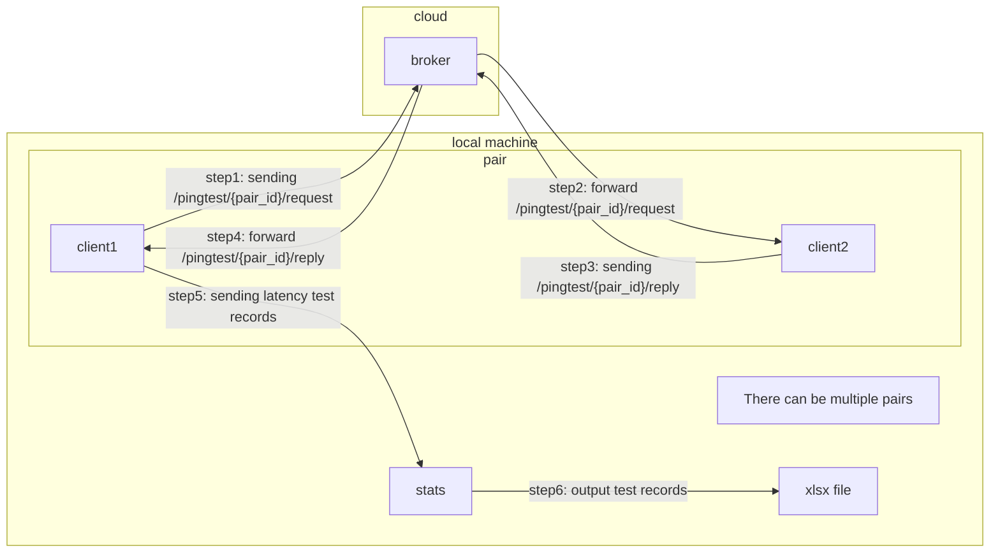

# IFN 712 - MQTT over KCP prototype program

A prototype program for PoC (Proof of Concept), is used to check and compare the latency performance between MQTT over
TCP and MQTT over KCP

## Key Components:
- pub: topic publishers in MQTT protocol
- broker: receive messages from pub and forward them to sub
- sub: topic subscribers in MQTT protocol

## Test Process
### Test Preparation
0. Launching the broker remotely or locally
1. Running the benchmark program locally, it will:
    - Launching specified numbers of sub
    - Launching specified numbers of pub
    - Sending requests/replies, calculate latency
    - save testing data to `.xlsx` file

### Process

## Thanks
Special appreciation to these open-source projects and their extraordinary contribution to the research project.

- [MQTT](https://github.com/jeffallen/mqtt)
- [KCP-GO](https://github.com/xtaci/kcp-go)
