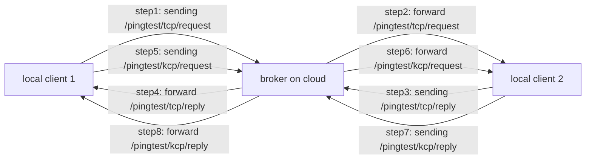

# IFN 712 - MQTT over KCP prototype program

A prototype program for PoC (Proof of Concept), is used to check and compare the latency performance between MQTT over
TCP and MQTT over KCP.

**DO NOT USE THE PROJECT IN PRODUCTION ENVIRONMENT!**

## Structure

```
├───experiment: experiment code for IFN712 
├───kcp: mqtt over kcp implementation
├───mqttsrv: a basic mqtt broker supporting both tcp and kcp
├───pub: a minimum mqtt over kcp publisher
├───sub: a minimum mqtt over kcp subscriber 
├───tcp: mqtt over tcp implementation
└───visual: data visualization
```

## Experiment

### Principle



The program will record all test records into a `.xlsx` file for analysis purposes.

## Environment for Experiment1

The experiment needs to be performed in different environments/configurations

| Env                  | Options                                                          |
|----------------------|------------------------------------------------------------------|
| Request Interval     | `0.1s`, `0.5s`, `1s`                                             |
| Message Payload Size | `60 bytes`, `500 bytes`, `1500 bytes`                            |
| Network Conditions   | `Ethernet`, `Wifi`, `Mobile 4G static`, `Mobile 4G while moving` |

## Environment for Experiment2

| Env                  | Options                                |
|----------------------|----------------------------------------|
| Request Interval     | `0.1s`, `0.5s`, `1s`                   |
| Message Payload Size | `5000 bytes`, `10000 bytes`            |
| Network Conditions   | `Ethernet`, `Wifi`, `Mobile 4G static` |

## Thanks

Special appreciation to these open-source projects and their extraordinary contribution to the research project.

- [MQTT](https://github.com/jeffallen/mqtt)
- [KCP-GO](https://github.com/xtaci/kcp-go)
